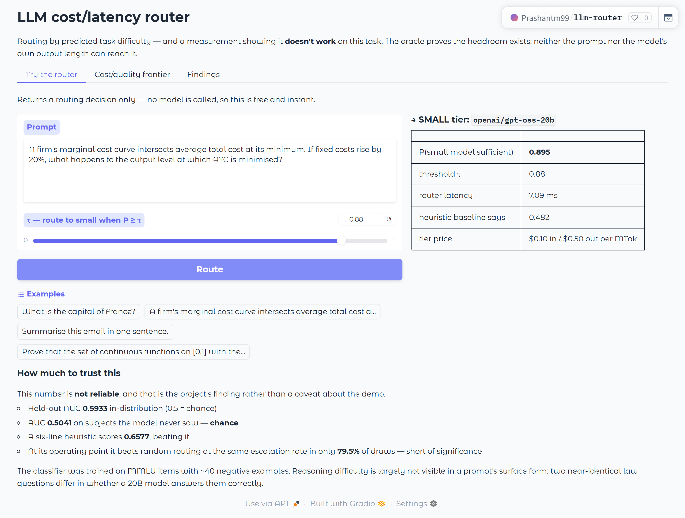
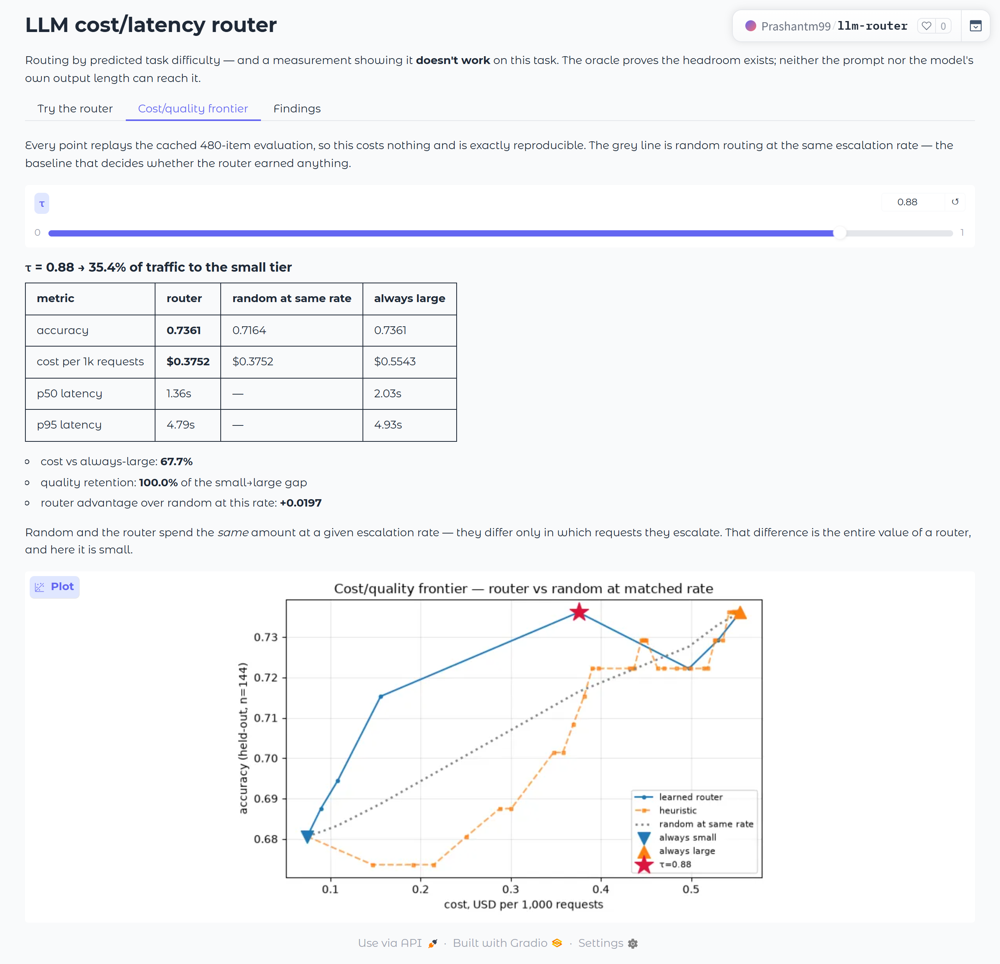
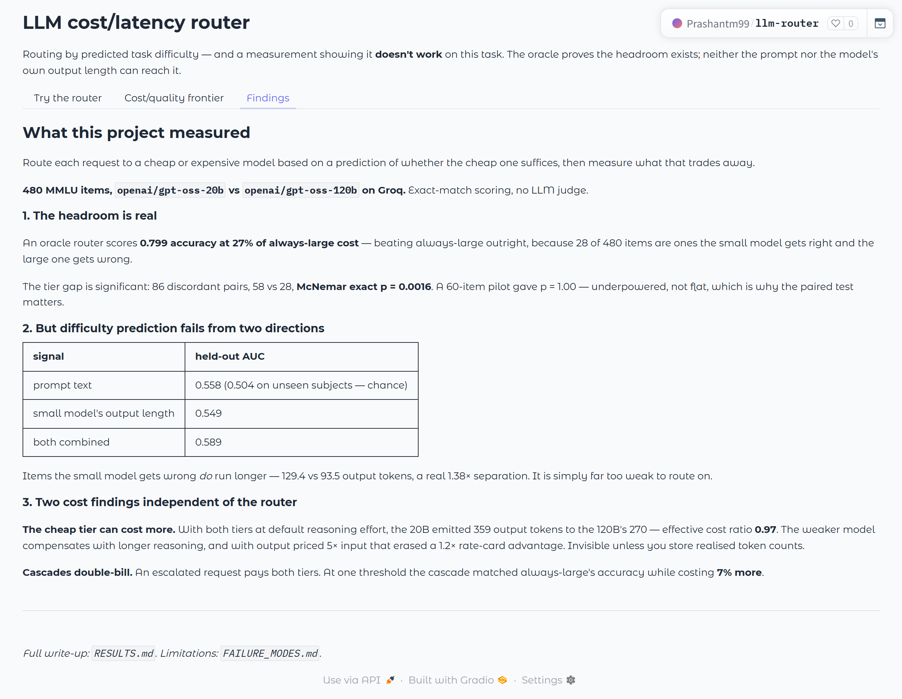

# LLM cost/latency router

[](https://huggingface.co/spaces/Prashantm99/llm-router)

Routes each request to a cheap model or an expensive one based on a learned
prediction of whether the cheap model will be good enough, then measures what
that trades away. The output is a cost/quality frontier and a defensible
operating point, not a claim that routing is free.

---

## Demo

**<https://huggingface.co/spaces/Prashantm99/llm-router>**

It calls no model. It loads the trained router and replays the cached 480-item
evaluation, so every number in it is a measured one and nothing in it costs
anything to run.

### Routing decision, shown with its own reliability

A prediction is returned in ~7 ms, and directly under it is the held-out AUC
that says how much to trust it. Presenting the decision without that number
would misrepresent the result this project exists to report.



### Cost/quality frontier vs random at a matched escalation rate

Sweep τ and watch the operating point move. The grey dotted line is random
routing escalating the *same fraction* of traffic — the only baseline that
isolates what the router's ordering is worth, since both policies spend the
same amount at a given rate.



<details>
<summary>Findings tab — the measured results in full</summary>



</details>

Reproduce the demo locally with the artifacts committed to this repo — no API
key and no spend:

```powershell
python -m pip install -r requirements-space.txt
python app.py                      # http://127.0.0.1:7860
```

---

## Results

**Difficulty prediction fails from two independent directions.** A learned
classifier over prompt text reaches AUC 0.593 in-distribution and 0.504 on
unseen subjects, is beaten by a six-line heuristic (0.658), and does not
significantly beat random routing at a matched escalation rate. Switching to the
small model's own behaviour does not rescue it: items it answers wrong do run
longer (129.4 vs 93.5 output tokens, a genuine 1.38x separation) but that yields
only 0.549 held-out AUC, and no cascade threshold beats always-large on both
cost and quality — at one point the cascade matches always-large's accuracy
while costing 7% MORE, because escalated items pay both tiers.

The oracle shows the headroom is real — 0.799 accuracy at 27% of always-large
cost, beating always-large outright. The signal exists. It is in neither the
prompt nor the output length.

Two cost findings independent of the router:

- With both tiers at default reasoning effort, the **cheap tier cost more**
  (effective ratio 0.97): the weaker model reasons longer, and with output
  priced 5x input that erased a 1.2x rate-card advantage.
- Setting the small tier to `reasoning_effort: low` cut its output from 359 to
  98 tokens and restored a 7.62x cost ratio. Effort level moves cost more than
  tier choice does.

Full numbers, the paired significance test, and the matched-rate random
baseline: **[RESULTS.md](RESULTS.md)**. Limitations: **[FAILURE_MODES.md](FAILURE_MODES.md)**.

## The idea

The naive framing is "classify task difficulty". That has no label source —
nobody can tell you the ground-truth difficulty of a prompt, and any proxy you
invent is circular.

The framing this repo uses instead:

> **y = 1 if the small model scored at least as well as the large model on this
> exact item.**

That label is *observed*, not assumed. Run both tiers once over a benchmark,
grade both programmatically, and the label falls out. It turns routing into
ordinary supervised binary classification with a real target, and it
re-specifies itself automatically when either model tier changes.

The router then predicts `P(small is sufficient | prompt)` from the prompt
alone — no reference answer, no model output, since neither exists at request
time — and routes to the small tier when `p >= τ`. `τ` is swept on held-out
data to trace the frontier.

## Architecture

```
tasks.jsonl ──> 02_run_offline_eval ──> records.jsonl   (both tiers, cached)
                    (the only script                    score/cost/latency
                     that spends money)                 per item, per tier
                                             │
                            ┌────────────────┴─────────────────┐
                            ▼                                  ▼
                   03_train_router                       04_simulate
              label = small_score >= large_score    replay any policy for free
              TF-IDF + stats -> calibrated LR       sweep 101 thresholds
                            │                       vs oracle / random / heuristic
                            ▼                                  │
                    router.joblib ──────────────────────> headline.json
                            │
                            ▼
                    serve.py  POST /v1/route   (decision only, ~3ms)
                              POST /v1/complete (decide + execute)
                              GET  /metrics     (Prometheus)
```

**The single most important structural decision** is separating measurement
from policy search. Both tiers run over the benchmark exactly once; every
routing policy is then evaluated by replaying cached outcomes. Sweeping 101
thresholds costs \$0 and is bit-for-bit reproducible. Calling the API inside the
sweep instead would cost real money per sweep, take hours, and return a
different answer every run from sampling noise.

## Files

```
src/llmrouter/
  config.py       model tiers + $/MTok, loaded from YAML (never hardcoded)
  providers.py    Anthropic/OpenAI-compat adapters + deterministic MockProvider
  tasks.py        benchmark loaders (GSM8K, MMLU, synthetic) + verifiable scorers
  features.py     prompt-only features, sklearn transformer
  router.py       heuristic baseline + learned calibrated classifier
  simulate.py     replay engine, policies, bootstrap CIs, threshold sweep
  serve.py        FastAPI: /v1/route, /v1/complete, /health, /metrics
scripts/          01 build -> 02 eval -> 03 train -> 04 simulate -> 05 plot -> 06 bench
                  07_diagnose.py    run this FIRST when a provider misbehaves
                  08_summarize.py   headline.json -> the tables in RESULTS.md
                  09_cascade_signal.py  can the small model's own output length
                                        predict its errors? (the second null result)
app.py            Gradio demo — the deployed Space, runnable locally
configs/          groq.yaml is the one the published run used (20B-low vs 120B-high);
                  groq_default_effort.yaml and groq_small_low.yaml are the two
                  effort configurations behind the cost-inversion finding;
                  default.yaml (Haiku vs Opus), sonnet_large.yaml, ollama.yaml
artifacts/        router.joblib + router_meta.json — the published trained router,
                  committed so `docker build` and the Space need no re-run
reports/          the published measured run; re-running the pipeline overwrites it
tests/            26 tests: scoring, pricing, cascade accounting, monotonicity,
                  retry/latency accounting, McNemar
```

## Setup (Windows / PowerShell)

Activate the venv **before** installing or running anything — the recurring
failure is running `pip install` against system Python and then wondering why
imports fail inside the venv.

```powershell
py -3.12 -m venv .venv
.\.venv\Scripts\Activate.ps1          # activate BEFORE installing
python -m pip install -r requirements.txt

# Free dry run — validates the whole pipeline, spends nothing
.\run_all.ps1 -Provider mock
```

If activation is blocked by execution policy:
`Set-ExecutionPolicy -Scope Process -ExecutionPolicy Bypass`

### Choosing a provider

The router does not care where tokens come from. It needs two tiers with a real
capability gap and reported token usage. Three supported paths:

| provider | cost | signup | model pair | notes |
|---|---|---|---|---|
| `groq` | **free** | API key, no card | gpt-oss 20B vs 120B | real capability gap, but only ~1.4× price gap |
| `anthropic` | ~\$10 | paid credit | Haiku 4.5 vs Opus 5 | 5× price gap |
| `ollama` | free | none | Qwen2.5 0.5B vs 7B | fully local, slow, no rate limits |

**Groq is the default recommendation if you don't have paid API credit.** Free
tier, no credit card, all models, ~30 req/min. Key from
<https://console.groq.com> → API Keys.

```powershell
$env:GROQ_API_KEY = "gsk_..."
# Diagnose FIRST — checks key, endpoint, model IDs, and a live scored call.
# Model IDs get decommissioned; this tells you before a bulk run silently
# fails on every item.
python scripts/07_diagnose.py --config configs/groq.yaml

# Modern reasoning models saturate GSM8K, so it yields degenerate labels
# against a 20B-vs-120B pair. MMLU's harder subjects carry the signal.
python scripts/01_build_dataset.py --config configs/groq.yaml --sources mmlu --limit 480

# Pilot on 60 items (sampled evenly across sources, not the first 60).
# Read per_source in reports/offline_eval.json before committing to a full run.
python scripts/02_run_offline_eval.py --config configs/groq.yaml --provider groq --workers 2 --limit 60
# then the full run; already-cached items are skipped
python scripts/02_run_offline_eval.py --config configs/groq.yaml --provider groq --workers 2
python scripts/03_train_router.py --config configs/groq.yaml
python scripts/04_simulate.py  --config configs/groq.yaml --quality-floor-drop 0.02
python scripts/05_plot.py      --config configs/groq.yaml
python scripts/06_bench_latency.py --config configs/groq.yaml

# Groq's tiers are close in price, so the cost headline there is capped.
# Replay the SAME routing decisions at a wider price ratio as a sensitivity
# check — clearly labelled COUNTERFACTUAL in headline.json:
python scripts/04_simulate.py --config configs/groq.yaml --price-config configs/default.yaml
```

On a narrow-price-gap provider, report **quality and latency as measured** and
present cost as a sensitivity across price ratios, not a single number. See
FAILURE_MODES.md §15.

Use `--workers 2` on a free tier. Higher concurrency produces more 429s, not
more throughput. 429s are retried with backoff automatically and the backoff
sleep is excluded from measured latency.

**Read this before quoting a dollar figure from a free-tier run.** Free-tier
inference costs \$0, so the dollars are published rates applied to measured
token counts — a model of what the traffic *would* cost, not a bill. The config
records this as `pricing_basis: imputed` and it is echoed into
`reports/offline_eval.json`. See FAILURE_MODES.md §12–13.

<details>
<summary>Anthropic (paid) and Ollama (local) commands</summary>

```powershell
# Anthropic — under $10 for 800 items across both tiers
$env:ANTHROPIC_API_KEY = "sk-ant-..."
python scripts/02_run_offline_eval.py --config configs/default.yaml --provider anthropic --workers 8

# Ollama — fully offline
#   ollama pull qwen2.5:0.5b ; ollama pull qwen2.5:7b ; ollama serve
python scripts/02_run_offline_eval.py --config configs/ollama.yaml --provider ollama --workers 2
```
</details>

Step 2 is resumable — already-cached `task_id`s are skipped, so a run killed
halfway is not paid for twice.

### Budget before you run

800 items × 2 tiers, ~500 input and ~300 output tokens each, at Haiku 4.5
(\$1/\$5 per MTok) and Opus 5 (\$5/\$25 per MTok):

- Haiku: 800 × (500×\$1 + 300×\$5) / 1e6 ≈ **\$1.60**
- Opus:  800 × (500×\$5 + 300×\$25) / 1e6 ≈ **\$8.00**

Under \$10 for a full evaluation. Verify current rates at
<https://platform.claude.com/docs/en/about-claude/pricing> before quoting any
figure — prices move, which is why they live in YAML and not in the code.

## Deployment

**Docker (the deployable path).** The trained router is baked into the image so
the running service is pinned to a specific evaluation run:

```powershell
docker build -t llm-router:0.1.0 .
docker run -p 8000:8000 -e ANTHROPIC_API_KEY=$env:ANTHROPIC_API_KEY llm-router:0.1.0
```

```powershell
curl -X POST http://localhost:8000/v1/route `
  -H "Content-Type: application/json" `
  -d '{\"prompt\": \"What is the capital of France?\"}'
# {"tier":"small","model_id":"claude-haiku-4-5","p_small_sufficient":0.9996,...}
```

**Where to host it.** Any container host works — Render, Fly.io, Railway, Cloud
Run. Set `ANTHROPIC_API_KEY` and `ROUTER_TAU` as secrets/env, never in the
image.

**The Gradio demo is a separate artifact from the service.** It is deployed at
<https://huggingface.co/spaces/Prashantm99/llm-router> and deliberately calls no
model: it returns routing decisions and replays cached evaluation results, so it
needs no API key and nothing about it can be billed. That is also why none of
the latencies it reports are end-to-end — a free Space sleeps and cold-starts,
which would dominate the very metric this project measures. Model latency comes
from `06_bench_latency.py` run against the real provider; the only latency the
demo reports for itself is the router's own ~7 ms inference.

To redeploy it:

```powershell
# hf-space/ is a clone of the Space (its own git remote), gitignored here.
#   git clone https://huggingface.co/spaces/Prashantm99/llm-router hf-space
Copy-Item app.py hf-space/
Copy-Item SPACE_README.md        hf-space/README.md        # front matter = Space config
Copy-Item requirements-space.txt hf-space/requirements.txt
Copy-Item -Recurse -Force src, configs, artifacts hf-space/

# Only the four the demo reads. Copying all of reports/ would publish the
# side-run files too, and app.py would still ignore them.
"headline.json", "cascade_signal.json", "pareto_learned.csv",
  "pareto_heuristic.csv" | ForEach-Object {
    Copy-Item "reports/$_" "hf-space/reports/$_"
  }

cd hf-space; git add -A; git commit -m "update"; git push
```

`artifacts/router.joblib` is a pickle, so the Space pins both
`python_version: "3.12"` (in the front matter) and `scikit-learn==1.9.0`. Bump
either only alongside a re-trained router.

**What to watch in production.** `/metrics` exposes escalation rate and
cumulative cost as Prometheus counters, because those are what drift. The
router is trained on one traffic mix; when the mix shifts, the small tier's hit
rate falls and the saving quietly evaporates while accuracy degrades. Alert on
escalation rate moving off its offline value, and re-run
`02_run_offline_eval.py` on a fresh traffic sample periodically. A router is not
a train-once artifact.

## Tests

```powershell
$env:PYTHONPATH="src"; python -m pytest tests/ -q
```

26 tests. The ones that matter: `test_oracle_is_an_upper_bound_on_quality`
(catches leakage — nothing may beat oracle),
`test_cascade_charges_both_tiers_on_escalation` (catches the most common way
these systems get oversold), `test_sweep_is_monotone_in_cost`, and
`test_cost_uses_reported_tokens`, and `test_latency_excludes_retry_backoff`
(a 429 retry sleep must not be charged to model latency — this was a real bug,
caught by the stub-server test rather than by reading the code).

## Known limits

See [FAILURE_MODES.md](FAILURE_MODES.md) — including the null result on
cross-source generalisation, which is the honest headline of this project and
is not buried.
